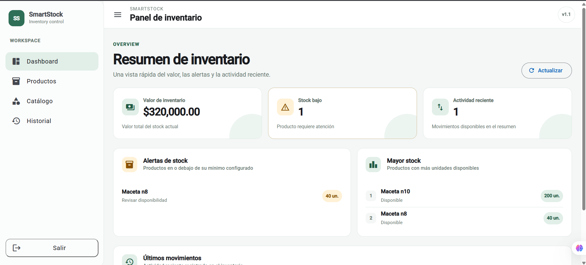
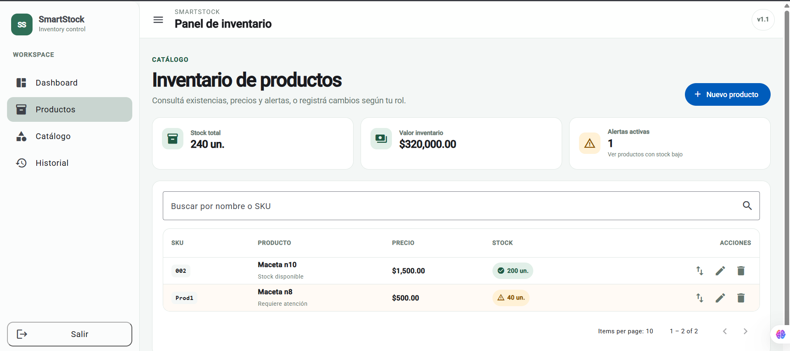
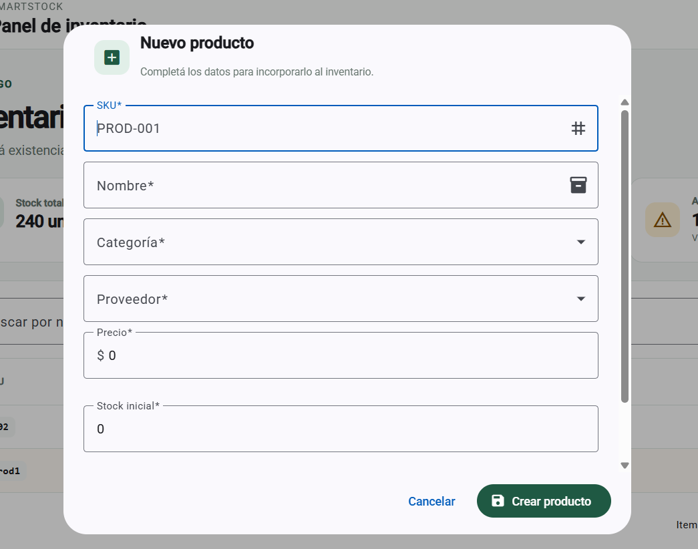
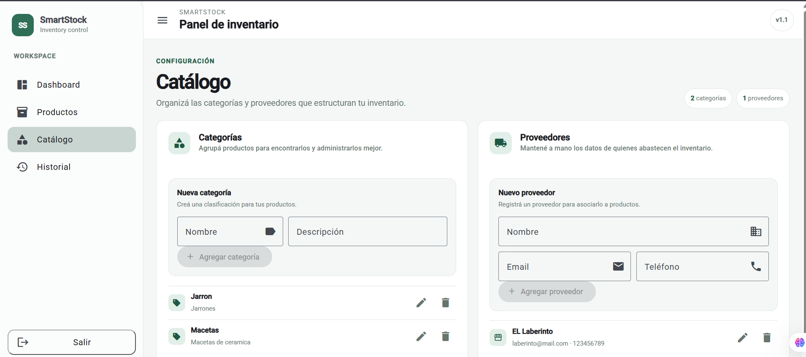
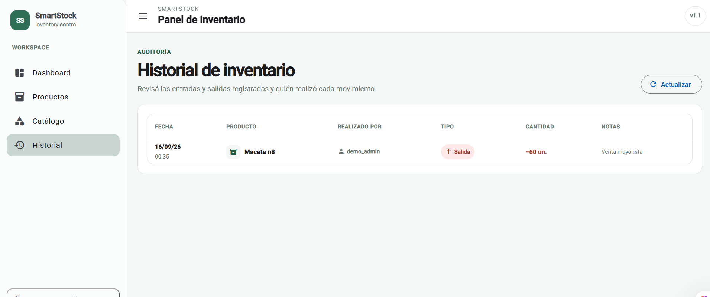
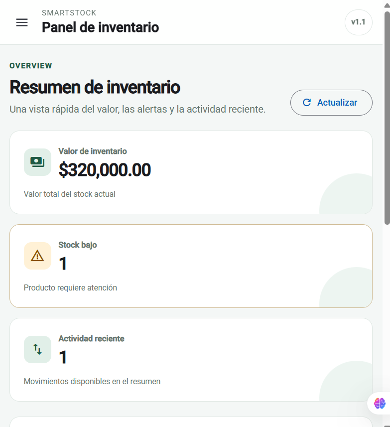

# SmartStock – Inventory Management System

SmartStock is a full-stack inventory management project built to model real business workflows around products, suppliers, stock movements, access control and inventory analytics.

The backend uses **Django + Django REST Framework**, runs on **PostgreSQL 16**, and is containerized with **Docker / Docker Compose**. The repository also includes an **Angular** frontend that consumes the REST API.

## Live demo

- Frontend: https://smartstock-frontend-aozn.onrender.com
- Backend API: https://smartstock-api-zh2d.onrender.com/api/
- Health check: https://smartstock-api-zh2d.onrender.com/api/health/
- OpenAPI / Swagger: https://smartstock-api-zh2d.onrender.com/api/docs/
- ReDoc: https://smartstock-api-zh2d.onrender.com/api/redoc/

The production deployment uses Render for the Angular static site, Django web service and managed PostgreSQL database. Demo accounts for the Admin, Staff and Viewer roles are provisioned from hosting-provider environment variables; passwords are never stored in the repository.

## Portfolio highlights\n\n- Production deployment with Angular, Django REST Framework and PostgreSQL\n- JWT authentication with Admin / Staff / Viewer RBAC\n- Auditable IN / OUT inventory movements and low-stock analytics\n- Dockerized local environment and reproducible Render deployment\n- Backend and frontend CI with automated validation\n- Responsive V1.1 interface validated in production\n\n## Visual tour

### Dashboard
Inventory value, low-stock alerts, highest-stock products and recent activity in one operational view.



### Product inventory
Searchable inventory with pricing, stock status and role-aware product and movement actions.



### Product workflow
Responsive product creation form with catalog relationships, pricing and initial stock.



### Catalog and audit trail
Categories and suppliers are managed separately from inventory operations, while stock movements keep user, type, quantity, notes and timestamp context.





### Responsive interface
The V1.1 shell adapts navigation and dashboard content for compact screens.



## Current status

SmartStock has a stable **v1.0.0** production release and a completed **v1.1 UI/UX polish** deployed to production. Core backend and frontend flows, JWT authentication, RBAC, inventory operations, analytics, OpenAPI documentation, automated tests, CI and the public deployment are operational.

## Tech stack

### Backend
- Python
- Django 6
- Django REST Framework
- django-filter
- SimpleJWT
- drf-spectacular / OpenAPI
- pytest / pytest-django / pytest-cov

### Database
- PostgreSQL 16

### Frontend
- Angular
- TypeScript
- Angular Material

### DevOps
- Docker
- Docker Compose
- Gunicorn
- WhiteNoise
- GitHub Actions
- Render
- Environment-based configuration

## Core features

### Product management
- Product CRUD
- SKU tracking
- Categories and suppliers
- Price and stock management
- Filtering, searching, ordering and pagination

### Inventory management
- IN / OUT stock movements
- Movement history with deterministic pagination
- User attribution
- Automatic stock updates
- Validation for non-positive quantities and insufficient stock

### Authentication and authorization
- JWT authentication
- Protected API endpoints
- Role-based access control using Django Groups
- Custom DRF permissions

Current roles:
- **Admin** – full system access
- **Staff** – inventory operations
- **Viewer** – read-only access

### Analytics

```text
/api/reports/inventory-value/
/api/reports/low-stock/
/api/reports/top-products/
```

### Product API capabilities

```text
/api/products/?category=1
/api/products/?search=maceta
/api/products/?ordering=price
/api/products/?ordering=-price
/api/products/?page=2
```

### Operations and API documentation

```text
/api/health/
/api/docs/
/api/redoc/
```

`GET /api/health/` is public and intentionally lightweight so a hosting provider can verify that the Django process is alive without accessing business data.

## Architecture

```text
SmartStock/
├── backend/
│   ├── config/              # Django project configuration
│   ├── products/            # Product, category and supplier domain
│   ├── inventory/           # Movements, permissions and reports
│   ├── services/            # Business/service layer
│   ├── conftest.py          # Shared pytest fixtures
│   └── manage.py
├── smartstock-frontend/     # Angular frontend
├── .github/workflows/       # CI
├── Dockerfile
├── docker-compose.yml
├── render.yaml
└── README.md
```

## Run locally with Docker

### 1. Clone the repository

```bash
git clone https://github.com/MirandaFrancoCBA/SmartStock.git
cd SmartStock
```

### 2. Configure environment variables

Copy `.env.example` to `.env` and replace development placeholders as needed. Do not commit the real `.env` file or production secrets.

### 3. Start the stack

```bash
docker compose up -d --build
```

The backend is exposed on port `8000` by the current Docker Compose configuration.

### 4. Apply migrations and bootstrap RBAC

```bash
docker compose exec backend python manage.py migrate
docker compose exec backend python manage.py seed_roles
```

### 5. Create an admin user and assign the SmartStock role

```bash
docker compose exec backend python manage.py createsuperuser
docker compose exec backend python manage.py seed_roles --username admin --role Admin
```

Django's `is_superuser` flag and SmartStock's application role are deliberately separate: SmartStock API/UI authorization uses the `Admin`, `Staff` and `Viewer` groups.

## Production deployment

The root `render.yaml` defines the Django web service and managed PostgreSQL integration. Production configuration and credentials are supplied through environment variables rather than committed files.

At container startup SmartStock performs the idempotent production bootstrap sequence:

```text
migrate -> seed_roles -> seed_demo_users -> Gunicorn
```

`seed_demo_users` is environment-driven. If demo credentials are not configured, it safely skips provisioning. If configured, the command creates or updates each demo user and assigns the corresponding SmartStock role. Passwords remain outside Git and can be rotated by changing the provider environment values and redeploying.

The Angular production environment points to the public HTTPS backend API, and the backend CORS configuration explicitly allows the deployed frontend origin.

## Public verification

The public deployment has passed the main end-to-end path: Angular loads over HTTPS, users authenticate through JWT against the Django API, production data is stored in PostgreSQL, and role-aware application access is operational.

Before tagging `v1.0.0`, the final release checks are:

- verify a deliberately low-stock product appears in the dashboard alert report
- verify direct refresh/navigation on Angular client-side routes through the static host
- complete the final Admin / Staff / Viewer permission smoke test
- review outstanding frontend dependency audit findings and document any accepted residual risk

## Tests and CI

Run the backend suite inside the container:

```bash
docker compose exec backend pytest
```

CI executes pytest against **PostgreSQL 16** on relevant pull requests and pushes to `main`. Critical flows covered include authentication, product protection, inventory IN/OUT, stock validation, RBAC, role bootstrap, health checks and analytics reports.

## Release roadmap

### v1.0
Production-ready portfolio release: authenticated inventory management, RBAC, analytics, automated tests/CI and public deployment.

### v1.1
UI/UX polish: visual identity, navigation hierarchy, dashboard presentation, tables, forms, responsive behavior and user-facing states.

### v2.0
Candidate major features include supplier catalog import and assisted product/price normalization workflows.

## Author

**Franco Rodrigo Miranda**  
Backend Developer | Python & Django – Argentina

- LinkedIn: https://www.linkedin.com/in/franco-rodrigo-miranda-993710248
- GitHub: https://github.com/MirandaFrancoCBA
